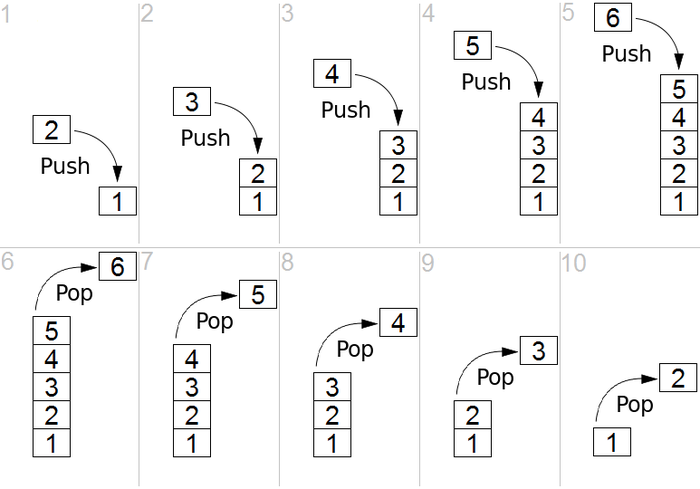

# Advanced Data Structures
In this module of the assingment we are going study to **Stacks**, **Queues**, and **Sets**.

## Stacks
Stacks are a FILO (First In Last Out) data structure.  Also known as LIFO (Laast In First Out) structures, the stack organizes  data in such a way that the user only has access to the most recent piece of data. For example, think of an email inbox. The most recent emails are at the top of the inbox and we generally start work our way down the stack of emails to the older email. Now inboxes are a complex system and we can access emails other than the top one but we can imagine it being a stack.

In order to implement a few methods in order to use our class. the `push` mothod will add an `element` to the top of the stack. The `pop` function will remove the top element off of the stack and return it to the user. Finally we will implement the `peek` method to allow us to take a look at the top element without removing from the list. The figure below illustrates the ideas behind these functions.

## Queues
Queues are a FIFO (First In First Out) data structure. The figure below show the ideas behind a queue. Think of them like a Line at the grocery store, the first person to get in the line is the first person to be helped and the first to exit the line.

