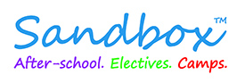

# Python Intermediate Classroom

Welcome to Python Fundementals, Intermediate edition! Our goal in this course is be to broaden the scope of you Python powers and introduce you to some fundemental ideas in Computer Science.

## Using this Classroom
We will be using a program call git to run this classroom, and as student you will use git to get new assigments, commit new changes after you have completed the assignments and turn in assignments. You will also use it too get access to the course material from home

Each of you will make a Github account on the first day of class if you have not made one previously. Make sure to commit you username and password to memory. 

Getting your repo for the first time (or on a new computer)

`git clone https://github.com/Sandbox4KidsTM/python-intermediate-Username`

**Be sure to replace 'Username' with your username**

Updating your repo (run every time you start working on the assignments)

`git pull`

After you make changes to the assignment you will need to **Stage** those changes with:
`git add -A`

And after staging those changes you will need to **Commit** those changes

`git commit -m "Your commit message here"`

And finally you will push your changes out to Github using 
`git push`

You can check git's status anytime using 
`git status`

## Prerequisites
This class assumes that you have been through Sandbox's Python Basics class or have experience with the following ideas:

* General Python Syntax
* Basic Types
* Variables
* Strings
* Comparisons
* Conditionals
* Lists
* Loops
* Dictionaries
* Tuples
* File Handling
* Functions
* Basic Computer Algorithms

## Topics in this Class
We will be covering a wide range of topics in this class. Here we will be giving an overview of the ideas we will be presenting in this class.

### Advanced Data Structures

This module is all about data structures in Python. As we learned in the Python Basics class, a data structure allow us to store our data in a logical and organized fashion. We examined a number of simple data structures; in particular the List, Dictionary and Tuples. In this class we will learn about **Stacks**, **Sets**, **Queues**, and **Strings**. We will also study the proper ways to interact with these data sets, and when to use each data structure.

### Intermediate Computer Alogrithms

During this module of the course we will be focusing on more sophisitcated algorithms to solve a number of problems. In particular we will take a close look at **Sorting** and **Searching** algorithms and how we can apply them to the data structures we studies in previous modules. We will also be learning how to time our algorithms and compare the runtimes of our algorithms to the sorting and searching algorithms that are implemented by the Python developers.

### Matplotlib and Numpy

### GUI Design and Tkinter

### Web Programming

### AI Application: Computer Vision

### AI Application: Voice Recognition